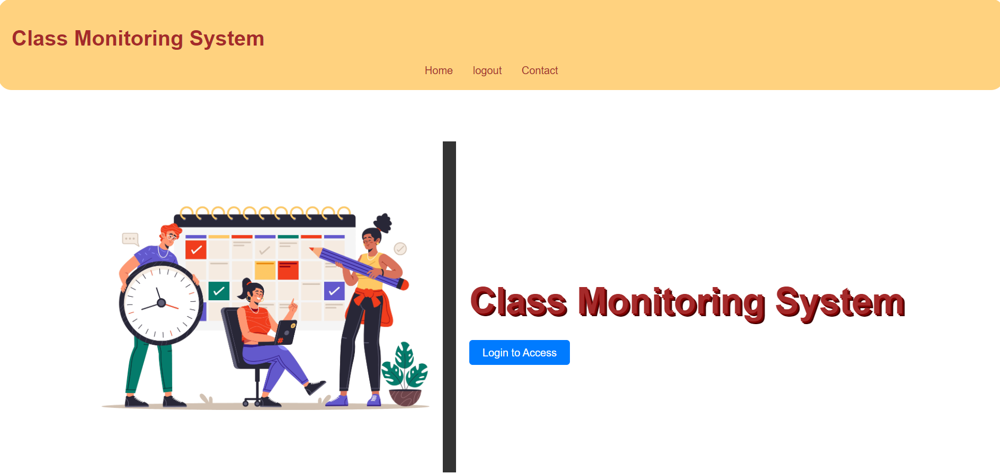
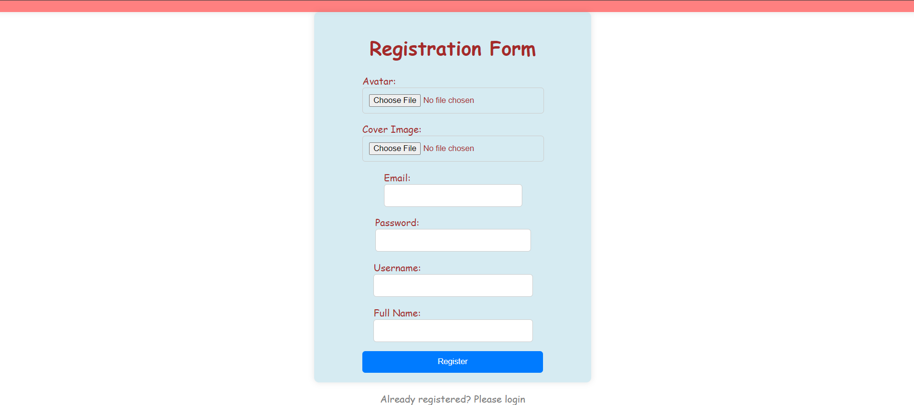
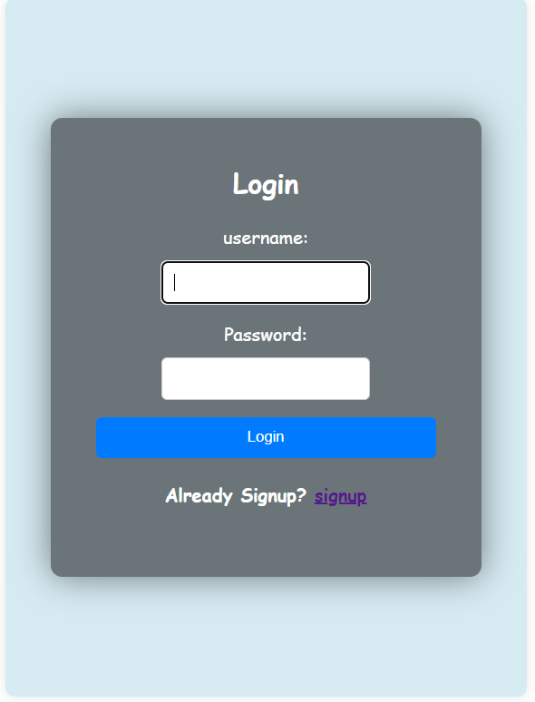
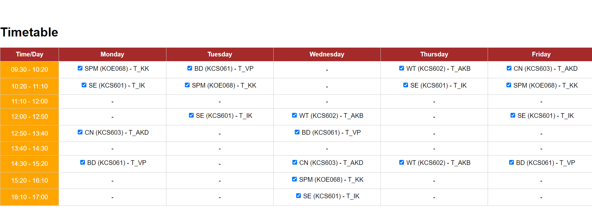
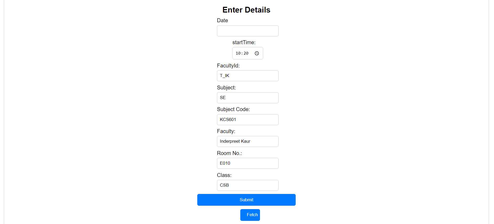
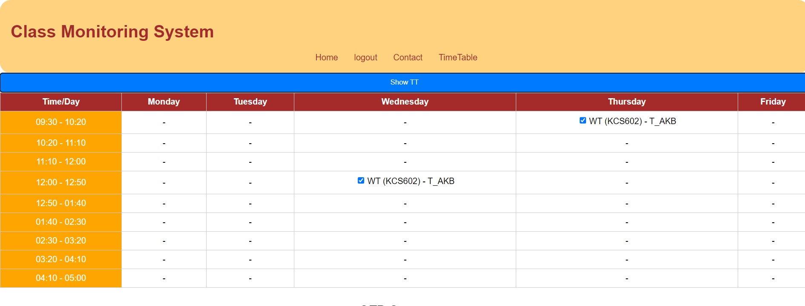
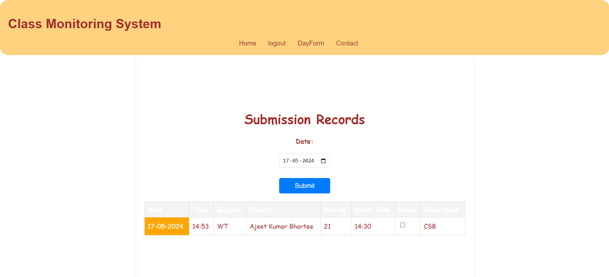

 [backend] https://github.com/prime-jd/cms <br>
 [frontend] https://github.com/prime-jd/frontend-cms
# Class Monitoring System 



<p>A Monitoring System to monitor and manage classroom activities. The main goal of class monitoring to remove limitations of old class monitoring and enhance the class management by participation of both student and teachers.


</p>

## Tech Stack
Given your previous interest in using MERN (MongoDB, Express, React, Node.js) and Docker, here’s how you might structure the project:

### 1. Backend (Node.js + Express)
Setup: Provide Schedule time table , fetch Schedule Create a RESTful API to handle CRUD operations for shedule enter, students, and teachers.<br>
Database:
Use MongoDB Atlas to store user data, class schedules, attendance records, etc.<br>
Authentication:
Implement JWT or sessions for user authentication and bcrypt for password hashing.

### 2. Frontend (React + Redux)
Setup: Create a user interface for managing and viewing data. Use React Router for navigation.
Components: Build components for signup, login, dashboard, schedule setup timetable, student management, etc.

#### signup (student and teacher)
Create a form for users to input their details (name, email, password, role).



#### login (student & teacher & hod)
User Authenticates itself through username and password. the user should be student , teacher and Hod. Each user have access to different components intheir reach



#### Select Day (student)
Username is displayed as user logins and an input field to select day.


#### Timetable display (student)
After Submitting day , time table of particular date is displayed <br>



#### Fetch Period (student)
After submitting day A form opened to fill details and after clicking fetch button it automatically fills the data by fetching and comparing  current date and time with that in timetable.



to verify the record the correct sets of schedule within that range is displayed as


#### Note : The teacher have to generate OTP and student have to fetch data within 5 minutes of start Time of period else the data will not submit or if submitted it will be deleted from record automatically.

#### OTP Submit (student)
The Teacher tells the OTP to student and the student enters the otp and submit it.
The otp generated by teacher present in the record that will be verifired when student submit otp and submitting the data for that period is recorded.


#### Teacher Schedule (teacher)
The timetable schedule of specific teacher displayed here of whole week.



#### Teacher OTP (teacher)
The teacher can generate OTP for specific period and student can fetch data within 5 minutes of start time.


#### Note: The Teacher can submit otp only when student submit the teacherschedule in record

#### Record (HOD)
The Record is accessible by Hod in which all details of subject and teachers and proxy(if another teacher attend class if subject teacher is absent) displayed.



## Packages and libraries used

Nodemon, dotenv, mongoose, prettier, express, CORS, cookie-parser, middlewares, bcrypt , JWT, mongoose-aggregate-paginate-v2, multer, cloudinary, mongodb connection, router(safe router), postman, Aggregation Pipelines

## To RUN
Check if nodemon is not running, run
 ```
 npm install nodemon --save -dev
  ```
1. Run Command
```
docker-compose up
```
2. After building file do following steps to remove bcrypt error(because of change of OS)
```
docker exec -it <container-name> bash
npm uninstall bcrypt
```
3. Reinstall bcrypt
```
npm install bcrypt
```
4. Enjoy


## Note : I used mongo Atlas that's why i didn't use mongo image in docker-compose.yaml . I provided a sample env file in root directory. consider backend code to derive models in mongoDB.
